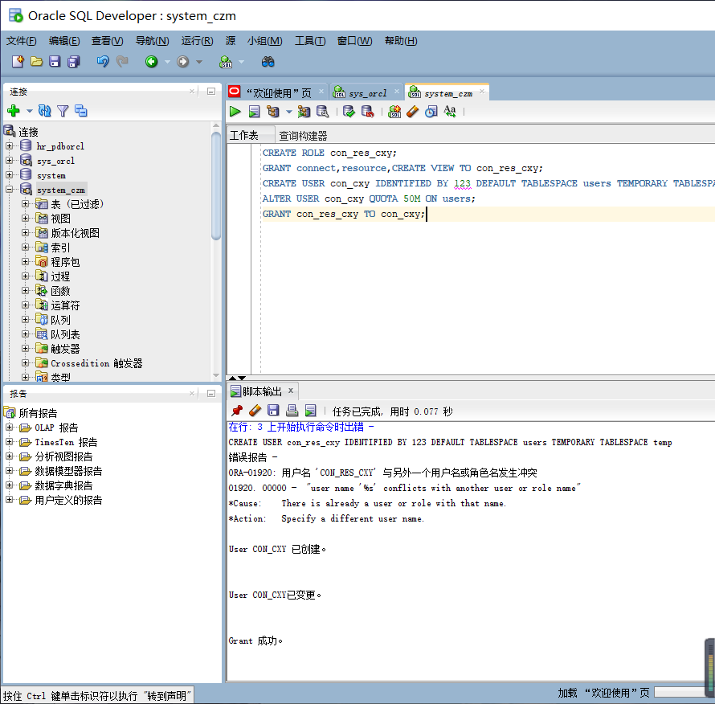
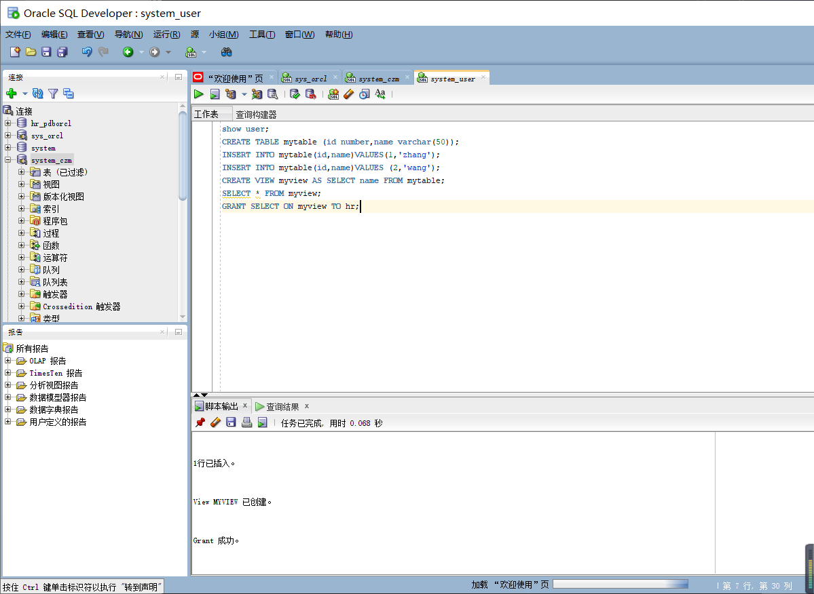
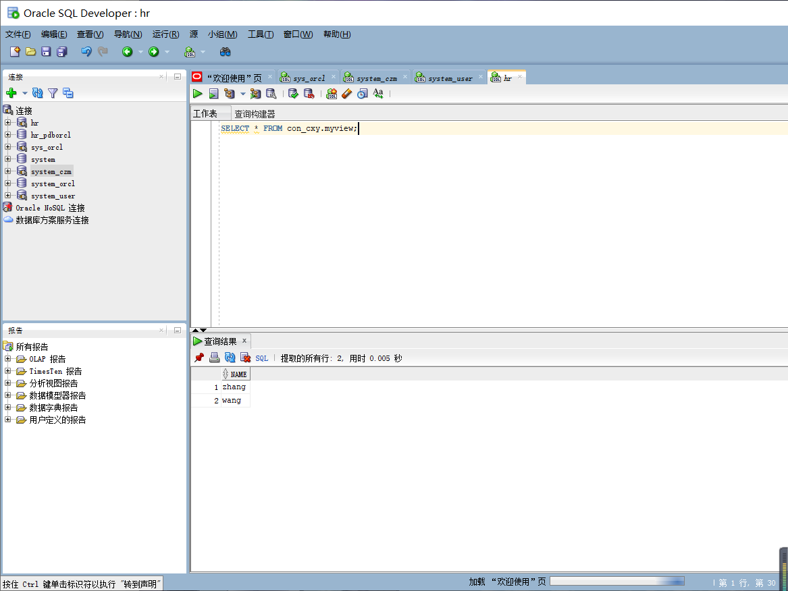
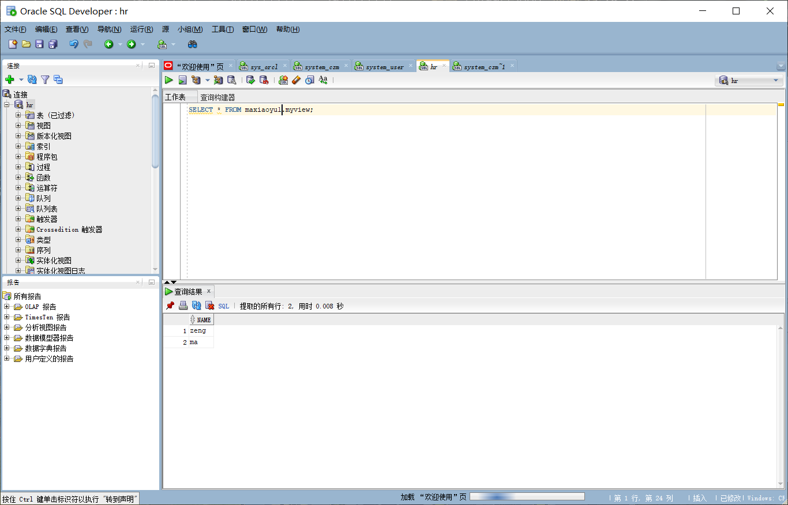
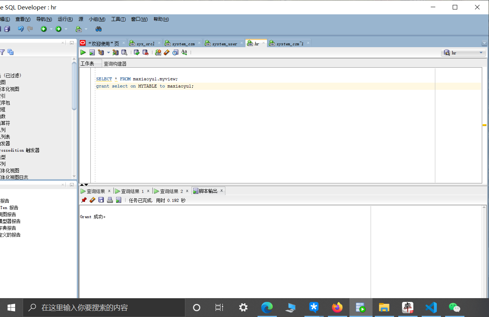
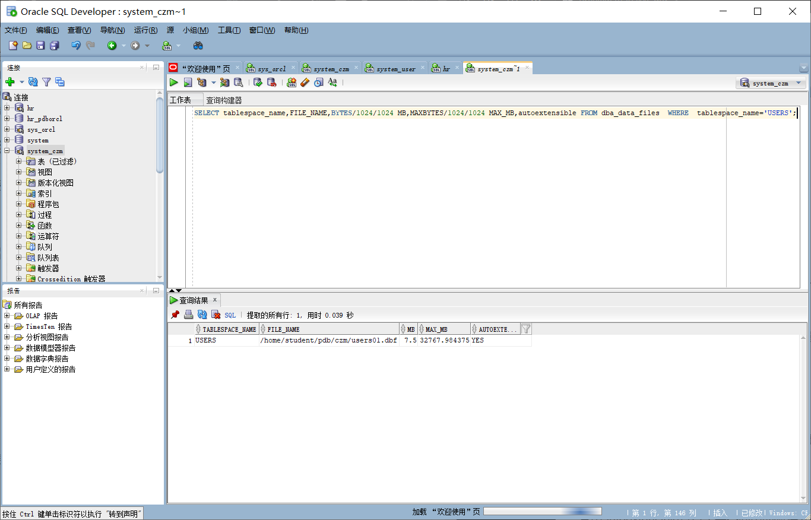
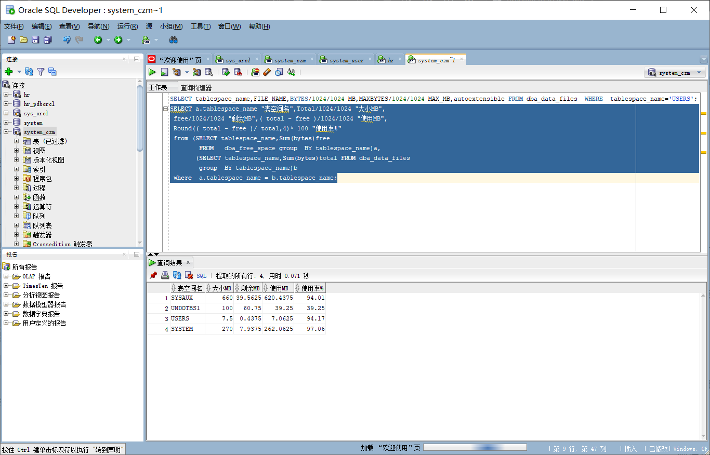

# 姓名：陈孝羽
# 学号：201810414208
# 班级：2018级软工2班

# 实验2：用户及权限管理
## 实验目的

掌握用户管理、角色管理、权根维护与分配的能力，掌握用户之间共享对象的操作技能。

## 实验内容

Oracle有一个开发者角色resource，可以创建表、过程、触发器等对象，但是不能创建视图。本训练要求：

•在pdborcl插接式数据中创建一个新的本地角色con_res_cxy，该角色包含connect和resource角色，同时也包含CREATE VIEW权限，这样任何拥有con_res_cxy的用户就同时拥有这三种权限。

•创建角色之后，再创建用户con_cxy，给用户分配表空间，设置限额为50M，授予con_res_cxy角色。

•最后测试：用新用户con_cxy连接数据库、创建表，插入数据，创建视图，查询表和视图的数据。

## 实验步骤

•第1步：以system登录到pdborcl，创建角色con_res_cxy和用户con_cxy，并授权和分配空间：

CREATE ROLE con_res_cxy;
GRANT connect,resource,CREATE VIEW TO con_res_cxy;
CREATE USER con_cxy IDENTIFIED BY 123 DEFAULT TABLESPACE users TEMPORARY TABLESPACE temp;
ALTER USER con_cxy QUOTA 50M ON users;
GRANT con_res_cxy TO con_cxy;
exit

•第2步：新用户con_cxy连接到pdborcl，创建表mytable和视图myview，插入数据，最后将myview的SELECT对象权限授予hr用户。

show user;
 CREATE TABLE mytable (id number,name varchar(50));
 INSERT INTO mytable(id,name)VALUES(1,'ma');
 INSERT INTO mytable(id,name)VALUES (2,'zeng');
 CREATE VIEW myview AS SELECT name FROM mytable;
 SELECT * FROM myview;
 GRANT SELECT ON myview TO hr;
 exit

•第3步：用户hr连接到pdborcl，查询con_cxy授予它的视图myview

SELECT * FROM con_cxy.myview;

•表的共享

grant select on MYTABLE to deep_love;

## 数据库和表空间占用分析
从数据库的使用情况来看，用户已经使用了很多了，只剩下7.9375MB可以用了，使用率达到了97.06%。

## 查看数据库的使用情况

•查看表空间的数据库文件，以及每个文件的磁盘占用情况。

在这个命令中autoextensible是显示表空间中的数据文件是否自动增加,而MAX_MB是指数据文件的最大容量。