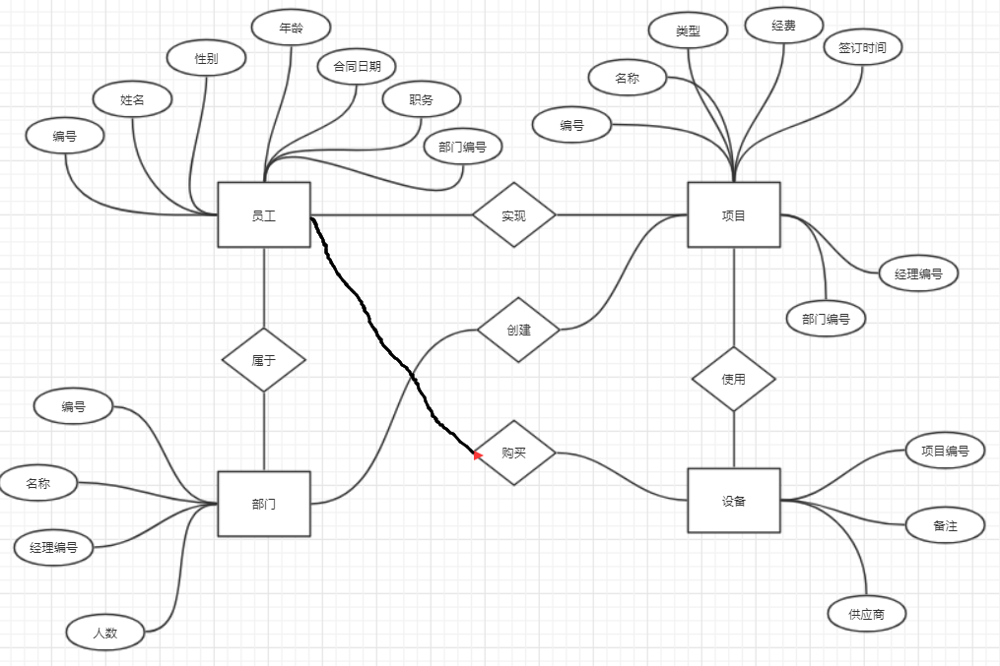
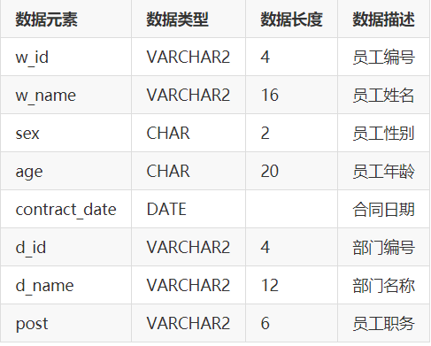
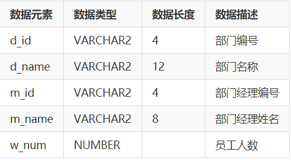
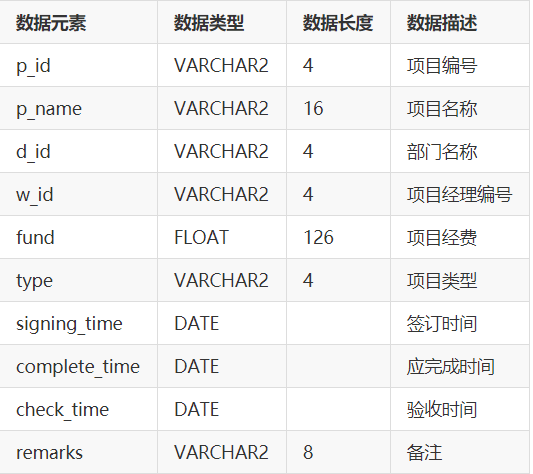
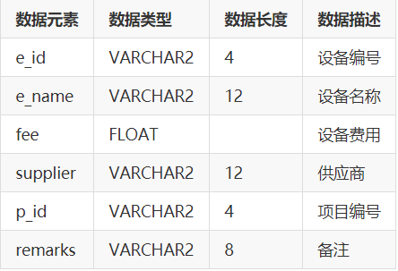

# 姓名：陈孝羽
# 学号：201810414208
# 班级：2018级软工2班

# 实验6：PL/SQL编程
## 实验目的
·自行设计一个信息系统的数据库项目，自拟 某项目 名称。

·设计项目涉及的表及表空间使用方案。至少5张表和5万条数据，两个表空间。

·设计权限及用户分配方案。至少两类角色，两个用户。

·在数据库中建立一个程序包，在包中用PL/SQL语言设计一些存储过程和函数，

·实现比较复杂的业务逻辑，用模拟数据进行执行计划分析。

·设计自动备份方案或则手工备份方案。

·设计容灾方案。使用两台主机，通过DataGuard实现数据库整体的异地备份(可选)。
## 实验内容
## 实验选题：项目管理系统

### 自行设计一个信息系统的数据库项目
项目管理系统，是反映公司员工资料，项目负责部门和项目进度，设备采购软件系统，是管理项目的有效工具。
面向用户：对项目进度跟踪，公司人员信息管理和设备管理的公司。只能由公司内部查看数据库中的数据。要求使用本系统的用户管理系统的使用有所了解，知道基本的操作和使用过程的注意事项。

### E-R图设计
一共有四个实体：员工、部门、项目、设备。

## 设计项目涉及的表及表空间使用方案

### 设计数据表

#### 员工表

#### 部门表

#### 项目表

#### 设备表

### 创建表空间 pdbtest_users02_1.dbf   pdbtest_users02_2.dbf

CREATE TABLESPACE Users02
    DATAFILE
    '/home/oracle/app/oracle/oradata/orcl/pdborcl/pdbtest_users02_1.dbf'
    SIZE 100M AUTOEXTEND ON NEXT 256M MAXSIZE UNLIMITED,
    '/home/oracle/app/oracle/oradata/orcl/pdborcl/pdbtest_users02_2.dbf'
    SIZE 100M AUTOEXTEND ON NEXT 256M MAXSIZE UNLIMITED
EXTENT MANAGEMENT LOCAL SEGMENT SPACE MANAGEMENT AUTO;

### 创建用户cxy与yxc

分配表空间pdbtest_users02_1.dbf 与 pdbtest_users02_2.dbf的使用配额，再分配角色CONNECT和RESOURCE,便于用户可以连接到数据库来创建资源，最后再分配一个系统权限："CREATE VIEW"，便于用户可以创建视图

--创建用户cxy
CREATE USER cxy IDENTIFIED BY 123
    DEFAULT TABLESPACE "USERS"
    TEMPORARY TABLESPACE "TEMP";

    -- QUOTAS
    ALTER USER YUKINO QUOTA UNLIMITED ON USERS;
    ALTER USER YUKINO QUOTA UNLIMITED ON USERS02;

    -- ROLES
    GRANT "CONNECT" TO cxy WITH ADMIN OPTION;
    GRANT "RESOURCE" TO cxy WITH ADMIN OPTION;
    ALTER USER cxy DEFAULT ROLE "CONNECT","RESOURCE";

    -- SYSTEM PRIVILEGES
    GRANT CREATE VIEW TO cxy WITH ADMIN OPTION;

    --创建用户yxc
    CREATE USER yxc IDENTIFIED BY 123
    DEFAULT TABLESPACE "USERS"
    TEMPORARY TABLESPACE "TEMP";

    -- QUOTAS
    ALTER USER yxc QUOTA UNLIMITED ON USERS;
    ALTER USER yxc QUOTA UNLIMITED ON USERS02;

    -- ROLES
    GRANT "CONNECT" TO yxc WITH ADMIN OPTION;
    GRANT "RESOURCE" TO yxc WITH ADMIN OPTION;
    ALTER USER yxc DEFAULT ROLE "CONNECT","RESOURCE";

    -- SYSTEM PRIVILEGES
    GRANT CREATE VIEW TO yxc WITH ADMIN OPTION;

### 创建表

/*==============================================================*/
/* Table: "worker"                                              */
/*==============================================================*/
create table "worker" 
(
   "w_id"               VARCHAR2(4)           not null,
   "w_name"             VARCHAR2(8),
   "sex"                CHAR(2),
   "age"                CHAR(2),
   "contract_date"      DATE,
   "post"               VARCHAR2(8),
   "d_id"               VARCHAR2(4),
   constraint PK_WORKER primary key ("w_id")
);
/*==============================================================*/
/* Table: "department"                                          */
/*==============================================================*/
create table "department" 
(
   "d_id"               VARCHAR2(4)           not null,
   "d_name"             VARCHAR2(16),
   "m_id"               VARCHAR2(4),   
   constraint PK_DEPARTMENT primary key ("d_id")
);
/*==============================================================*/
/* Table: "project"                                             */
/*==============================================================*/
create table "project" 
(
   "p_id"               VARCHAR2(4)           not null,
   "p_name"             VARCHAR2(16),
   "fund"               FLOAT(126),
   "type"               VARCHAR2(4),
   "signing_time"       DATE,
   "complete_time"      DATE,
   "check_time"         DATE,
   "m_id"               VARCHAR2(4),
   "remarks"            VARCHAR2(256),
   constraint PK_PROJECT primary key ("p_id")
);
/*==============================================================*/
/* Table: "equipment"                                           */
/*==============================================================*/
create table "equipment" 
(
   "e_id"               VARCHAR2(4)           not null,
   "e_name"             VARCHAR2(16),
   "fee"                FLOAT(126),
   "supplier"           VARCHAR2(16),
   "p_id"               VARCHAR2(4),
   "remarks"            VARCHAR2(256),
   constraint PK_EQUIPMENT primary key ("e_id")
);

### 插入数据

#### worker表

INSERT INTO "worker" VALUES ('1008', '马化腾', '男', '29', TO_DATE('20171229201245', 'YYYYMMDDHH24MISS'), '经理', '11');
INSERT INTO "worker" VALUES ('1011', '雷军', '男', '21', TO_DATE('20171220085418', 'YYYYMMDDHH24MISS'), '职员', '11');
INSERT INTO "worker" VALUES ('1006', '司马懿', '男', '56', TO_DATE('20171229202106', 'YYYYMMDDHH24MISS'), '职员', '13');
INSERT INTO "worker" VALUES ('1005', '王超', '男', '38', TO_DATE('20171018161809', 'YYYYMMDDHH24MISS'), '经理', '14');
INSERT INTO "worker" VALUES ('1001', '张三', '男', '26', TO_DATE('20171026143550', 'YYYYMMDDHH24MISS'), '职员', '11');
INSERT INTO "worker" VALUES ('1002', '李四', '男', '25', TO_DATE('20171026143733', 'YYYYMMDDHH24MISS'), '职员', '12');
INSERT INTO "worker" VALUES ('1003', '李玲', '女', '27', TO_DATE('20171026144030', 'YYYYMMDDHH24MISS'), '经理', '13');
INSERT INTO "worker" VALUES ('1004', '王五', '男', '25', TO_DATE('20171026144412', 'YYYYMMDDHH24MISS'), '经理', '14');

#### department表

INSERT INTO "department" VALUES ('11', '采购部', '1008');
INSERT INTO "department" VALUES ('12', '销售部', '1002');
INSERT INTO "department" VALUES ('13', '策划部', '1003');
INSERT INTO "department" VALUES ('14', '人事部', '1004');

#### project表

INSERT INTO "project" VALUES ('004', '跨海大桥', 300000000, '桥梁', TO_DATE('20160226150155', 'YYYYMMDDHH24MISS'), TO_DATE('20170326150206', 'YYYYMMDDHH24MISS'), TO_DATE('20171001150213', 'YYYYMMDDHH24MISS'), '1004', NULL);
INSERT INTO "project" VALUES ('001', '京沪高速', 300000, '建筑', TO_DATE('20170901145036', 'YYYYMMDDHH24MISS'), TO_DATE('20171026145042', 'YYYYMMDDHH24MISS'), TO_DATE('20171027145048', 'YYYYMMDDHH24MISS'), '1005', NULL);
INSERT INTO "project" VALUES ('002', '青藏铁路', 1500000, '建筑', TO_DATE('20170701145439', 'YYYYMMDDHH24MISS'), TO_DATE('20170901145459', 'YYYYMMDDHH24MISS'), TO_DATE('20171026145505', 'YYYYMMDDHH24MISS'), '1008', NULL);
INSERT INTO "project" VALUES ('003', '鸟巢', 30000000, '工程', TO_DATE('20170801145900', 'YYYYMMDDHH24MISS'), TO_DATE('20170901145906', 'YYYYMMDDHH24MISS'), TO_DATE('20171004145911', 'YYYYMMDDHH24MISS'), '1003', NULL);

#### equipment表

INSERT INTO "equipment" VALUES ('101', '挖掘机', 100000, '徐工', '001', NULL);
INSERT INTO "equipment" VALUES ('102', '玻璃', 10000, '通用', '003', NULL);
INSERT INTO "equipment" VALUES ('103', '铝合金', 20000, '上汽', '002', NULL);
INSERT INTO "equipment" VALUES ('104', '液晶', 50000, '京东方', '004', NULL);
INSERT INTO "equipment" VALUES ('105', '台式机', 100000, '清华同方', '003', '办公专用');
INSERT INTO "equipment" VALUES ('108', 'A4纸', 200, '华润', '003', NULL);
INSERT INTO "equipment" VALUES ('109', '键鼠套装', 1000, '达尔优', '003', NULL);

### 在数据库中建立一个程序包

在包中用PL/SQL语言设计一些存储过程和函数，实现比较复杂的业务逻辑，用模拟数据进行执行计划分析。

    create or replace PACKAGE SPM_Pack IS
    /*
    包SPM_Pack中有：
    一个函数:Get_SaleAmount(V_DEPARTMENT_ID NUMBER)，
    一个过程:Get_Employees(V_EMPLOYEE_ID NUMBER)
    */
    FUNCTION Get_SaleAmount(V_DEPARTMENT_ID NUMBER) RETURN NUMBER;
    PROCEDURE Get_Employees(V_EMPLOYEE_ID NUMBER);
    END SPM_Pack;
    /
    create or replace PACKAGE BODY SPM_Pack IS
    FUNCTION Get_SaleAmount(V_DEPARTMENT_ID NUMBER) RETURN NUMBER
    AS
        N NUMBER(20,2);
        BEGIN
        SELECT SUM(O.TRADE_RECEIVABLE) into N  FROM ORDERS O,EMPLOYEES E
        WHERE O.EMPLOYEE_ID=E.EMPLOYEE_ID AND E.DEPARTMENT_ID =V_DEPARTMENT_ID;
        RETURN N;
        END;

    PROCEDURE GET_EMPLOYEES(V_EMPLOYEE_ID NUMBER)
    AS
        LEFTSPACE VARCHAR(2000);
        begin
        LEFTSPACE:=' ';
        for v in
        (SELECT LEVEL,EMPLOYEE_ID,NAME,MANAGER_ID FROM employees
        START WITH EMPLOYEE_ID = V_EMPLOYEE_ID
        CONNECT BY PRIOR EMPLOYEE_ID = MANAGER_ID)
        LOOP
            DBMS_OUTPUT.PUT_LINE(LPAD(LEFTSPACE,(V.LEVEL-1)*4,' ')||
                                V.EMPLOYEE_ID||' '||v.NAME);
        END LOOP;
        END;
    END SPM_Pack;
    /

## 备份方案

Oracle数据库有三种标准的备份方法，它们分别是导出／导入（EXP/IMP）、热备份和冷备份。导出备件是一种逻辑备份，冷备份和热备份是物理备份。
零级备份
rman> replace global script. global_inc0 comment
"backup database as incremental level 0"{
execute global script  global_del;
allocate channel d1 device type disk;
set limit channel d1 readrate = 10240;
set limit channel d1 kbytes = 4096000;
backup as compressed backupset
incremental level = 0
format ='/rmanbak/inc0_%d_%U'
tag = 'inc0'
channel =d1
database;
release channel d1;
execute global script. global_arch;
execute global script. global_bkctl;
}
1级备份
rman> replace global script. global_inc1 comment
"backup database as incremental level 1"{
execute global script  global_del;
allocate channel d1 device type disk;
set limit channel d1 readrate = 10240;
set limit channel d1 kbytes = 4096000;
backup as compressed backupset
incremental level = 1
format ='/rmanbak/inc0_%d_%U'
tag = 'inc1'
channel =d1
database;
release channel d1;
execute global script. global_arch;
execute global script. global_bkctl;
}
2级备份
rman> replace global script. global_inc2 comment
"backup database as incremental level 2"{
execute global script  global_del;
allocate channel d1 device type disk;
set limit channel d1 readrate = 10240;
set limit channel d1 kbytes = 4096000;
backup as compressed backupset
incremental level = 2
format ='/rmanbak/inc0_%d_%U'
tag = 'inc2'
channel =d1
database;
release channel d1;
execute global script. global_arch;
execute global script. global_bkctl;
}

## 实验总结

    通过本次实验，让我对数据表的设计有了更为清晰的理解，在设计方面也更加熟练，同时还涉及到了数据的插入和数据的备份，这些都使我受益匪浅。